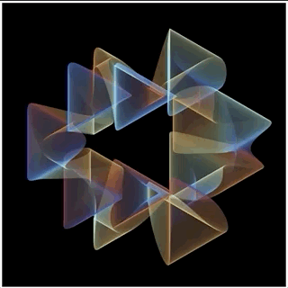
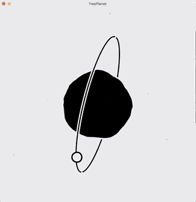
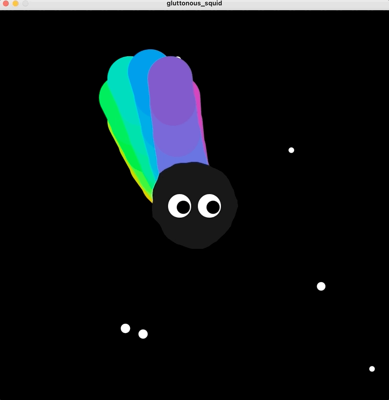

# Jerusalem

This is a collection of Processing sketches depicting the Jerusalem in my mind.

## Overview

The Bible does not directly describe heaven, but depicts [Jerusalem](https://simple.wikipedia.org/wiki/Jerusalem), the holy city that fell from the sky, which like a model of heaven, or a corner of it. So the following sketches also depicts part of the heaven in my mind.

The code for all the sketches is not long, and I create each of them inspiring by one or other people’s projects.

&emsp;&emsp;

&emsp;&emsp;

## Waltz of the circles

The Jerusalem in my mind begins with *Waltz of the circles*, which shows the beauty of math and the secret of the university. It is based on *[Instanced WebGL Circles](https://observablehq.com/@rreusser/instanced-webgl-circles)*. *Waltz of the circles* implements the similar effects of **Instanced WebGL Circles** in Processing and adds some interactions which makes it more expressive and interesting.

The most remarkable thing of *Waltz of the circles* is that although the whole visual effects is complex, the basic shape forms it is very simple. They are just some basic circles with diameter, color, position varying over time by triangular function.

When users move their mouse vertically, they can see how the change of the amount of the circles affects the final visual effects to better understand its principle. They can also move their mouse horizontally to reduce or increase the vertices of each circle to experience different beauty.

So the Jerusalem in my mind begins just like the mysterious universe where you **put some math and some fundamental elements and you’ll be impressed by its evolutionary results.**

## Ice and Fire

Instead of using math to control particles, it is also possible to use physic principles to combine them into any shapes, then here comes to *Ice and Fire*.

*Ice and Fire* is inspired by the *[Fire brush](https://www.openprocessing.org/sketch/415191)*, I change the color, shape and the definition of the particles.

Normally, fire and ice can’t coexist, but in my Jerusalem ice can burns into fire. This reveal one of the greatest joy of coding that you the god for your program, and here I make two contradictory things look harmonious.

There is an old saying that the sun always comes after wind and rain, but here fire comes after ice. **A single spark can start a prairie fire after ice and snow, just like we need try hard to succeed.**

## Tree Plant

**A flower can be a world, and a particle can be a planet.**

I based the planet created by [Santiago Fiorino](https://www.openprocessing.org/sketch/567018) to build a planet can grows tree by my own. Each time you click the planet, it will grow a tree with a random color.

And on this tree plant, it can only consist of three at most, otherwise the extra trees will die.

## Gluttonous Squid

Whenever there is a plant, there will be a monster trying to eat it.

In my Jerusalem, it is the *Gluttonous Squid* which is  inspired by this this *[Weird tentacle thingie](https://www.openprocessing.org/sketch/184838)*. It is so cute that you will not be angry at all even it eats colorful plants for fun. The closer the mouse to it, the larger and faster it is.

**There is always a little monster in everyone's deep  heart, it has our best and worst sides.**

## Rainbow Dragon

Speaking to monster, I must illustrate the oldest and the most distinguished creature -- **Rainbow Dragonin** my Jerusalem.

The background of the sketch is my favorite color yellow and with the help of  perlin noise and HSB color mode, a dragon consist of some rectangles has been created smoothly.

“My mom always said life was like a box of chocolates. You never know what you're gonna get.” And here life was like a group of rectangles, you never know how they will look like in the end.

**Uncertainty makes life worth looking forward to.**

## Mr.Bug

There is also a tiny little *Mr.Bug* except monsters and dragons. Unlike terrible and annoying bugs in programming, this bug is full of energy and is able to be easily getting along with. His dream is to travel around the world, which is the entire sketch for a 2d creature. Every time he reaches a new place, he will paint the cell as a sign of coming and this will eventually forms an amazing color pattern.

He can travel in BFS(Breadth-first search) or DFS(Depth-first search) algorithm, and switch between the two methods when user clicks the screen which makes him paint the world with both advantages of BFS and DFS.

The left picture below is only in BFS mode, it is a little bit monotonous, because the color is layer by layer as a result of the main feature of BFS. The middle picture below is only in DFS mode, it is not tedious but looks like in chaos. While the pattern is pretty comfortable and amusing when the bug takes into both modes account.  

**In real life, BFS means doing a part of tasks by turn, while DFS means doing tasks one by one. The bug tell us the truth that only when we make balance between two of methods, we can achieve a better outcome and enjoy a more pleasing and memorable journey.**

This sketch is inspired by the great work done by [Mike Bostock](https://bl.ocks.org/mbostock/11337835).

&emsp;&emsp;
