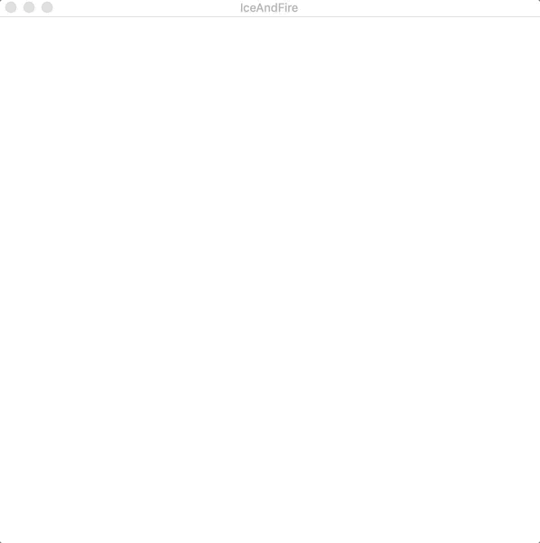

# Jerusalem

There is a collection of Processing sketches to depicts the Jerusalem in my mind.

## Overview

The Bible does not directly describe heaven, but depicts [Jerusalem](https://simple.wikipedia.org/wiki/Jerusalem), the holy city that fell from the sky, like a model of heaven, or a corner of it. So the following sketches also depicts part the heaven in my mind.

The code for all the sketches is not long, and I create each them inspired by one or more other people’artworks.

&emsp;&emsp;

&emsp;&emsp;

## Waltz of the circles

The Jerusalem in my mind begin with Waltz of the circles, which show the beauty of math and the secret of the university. It is based on [Instanced WebGL Circles](https://observablehq.com/@rreusser/instanced-webgl-circles). Waltz of the circles implements the similar effects of Instanced WebGL Circles in Processing and add some interactions which make it more expressive and interesting. T

he most remarkable thing of Waltz of the circles is that although the whole visual effects is complex, the basic shape forms it is very simple. They are just some basic circles with diameter, color, position varying over time by triangular function.

When you mouse your mouse vertically, you can see how the change of the amount of the circles affect the final visual effects to better understand its principle. You can also move you mouse horizontally to reduce or increase the vertices of each circle to experience different beauty.

So the Jerusalem in my mind begins just like the mysterious universe where you put some math and some particles and you’ll  be impressed by its Evolutionary results.

## Ice and Fire

Instead of using math to control particles, it is also possible to use physic principles to combine them any shapes I want，then here comes to Ice and Fire. Ice and Fire is inspired by the fire brush, I change the color, shape and the definition of the particles. Normally, fire and ice can’t coexist, but in my Jerusalem ice can burn into fire. This revel one of the greatest joy of coding that you the god for you program, and here I make two completely confit things look peaceful.

## Tree Plant

A flower can be a world, and a particle can a plant. I based the Plant created by __ to build a plant can grows trees by my own, Each time you click the plant, it will grow a random color tree. And on this tree plant, it will consist of threes at most,  otherwise the extra tree will die.

## Gluttonous Squid

Whenever there is a plant, there will a monster try to eat it. In my Jerusalem, it is the Gluttonous Squid which is a combination of this sketch and this sketch. It is so cute that you will not be angry at all even it eat colorful plants for fun. The closer you mouse with it, the larger and faster it is.	

## Rainbow Dragon

Speaking to monster, I must illustrate the oldest and the most distinguished creature dragon in my Jerusalem. The background of the sketch is my favorite color yellow and with the help of  perlin noise and HSB color mode, a dragon consist of some rectangles has been created.

## Painter Bug

There is also a tiny little bug except monsters and dragons. Unlike terrible and annoying bugs in programming, this bug is full of energy and is able to easily get along with. His dream is to travel around the world, which is the entire sketch for a 2d creature. Every time he reach a new place, he will paint the cell as a sign of coming and this will eventually form an amazing color pattern.

He can travel in BFS(Breadth-first search) or DFS(Depth-first search) algorithm, and switch between the two methods when user click the screen which allow him paint the world with both advantages of BFS and DFS.

The left picture below is only in BFS mode, it is a little bit Monotonous, because the color is layer by layer as a result of the main feature of BFS. The middle picture below is only in DFS mode, it is not tedious but looks like in chaos. But the pattern is pretty comfortable and amusing when the bug take into both modes account.  

In real life, BFS means doing a part of tasks by turn, while DFS means doing tasks one by one. The bug tell us a truth that only when we make balance between two of methods, we can achieve a better outcome and a pleasing and memorable journey.

&emsp;&emsp;
